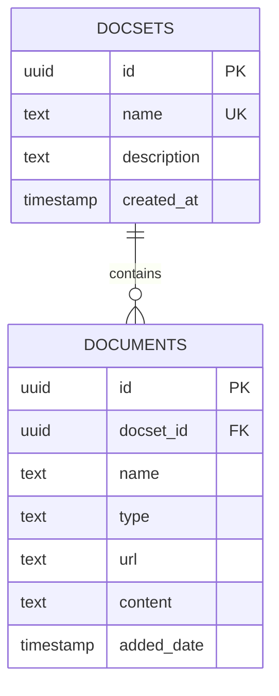

# RAGSpace 数据库架构文档

## 概述

RAGSpace使用Supabase作为后端数据库，基于PostgreSQL构建。数据库设计支持文档集合管理、文档存储和查询功能。

## 数据库架构图



## 表结构详情

### 1. 文档集合表 (docsets)

**表名**: `docsets`

| 字段名 | 数据类型 | 约束 | 说明 |
|--------|----------|------|------|
| `id` | `uuid` | `PRIMARY KEY, DEFAULT gen_random_uuid()` | 主键，自动生成的UUID |
| `name` | `text` | `UNIQUE NOT NULL` | 文档集合名称，唯一 |
| `description` | `text` | `NULL` | 文档集合描述 |
| `created_at` | `timestamp` | `DEFAULT now()` | 创建时间 |

**索引**:
```sql
-- 主键索引（自动创建）
-- 唯一索引（自动创建）
```

**示例数据**:
```sql
INSERT INTO docsets (name, description) VALUES 
('Python Documentation', 'Python programming language documentation'),
('API Reference', 'API documentation and examples'),
('Tutorials', 'Step-by-step tutorials and guides');
```

### 2. 文档表 (documents)

**表名**: `documents`

| 字段名 | 数据类型 | 约束 | 说明 |
|--------|----------|------|------|
| `id` | `uuid` | `PRIMARY KEY, DEFAULT gen_random_uuid()` | 主键，自动生成的UUID |
| `docset_id` | `uuid` | `FOREIGN KEY REFERENCES docsets(id) ON DELETE CASCADE` | 外键，关联到docsets表 |
| `name` | `text` | `NULL` | 文档名称 |
| `type` | `text` | `CHECK (type IN ('file', 'url', 'github', 'website'))` | 文档类型 |
| `url` | `text` | `NULL` | 文档来源URL |
| `content` | `text` | `NULL` | 文档内容 |
| `added_date` | `timestamp` | `DEFAULT now()` | 添加时间 |

**索引**:
```sql
CREATE INDEX idx_documents_docset_id ON documents(docset_id);
CREATE INDEX idx_documents_type ON documents(type);
CREATE INDEX idx_documents_added_date ON documents(added_date);
```

**示例数据**:
```sql
INSERT INTO documents (docset_id, name, type, url, content) VALUES 
(
    (SELECT id FROM docsets WHERE name = 'Python Documentation'),
    'Python Basics',
    'file',
    NULL,
    'Python is a high-level programming language...'
),
(
    (SELECT id FROM docsets WHERE name = 'API Reference'),
    'REST API Guide',
    'url',
    'https://example.com/api/docs',
    'This document describes the REST API endpoints...'
);
```

## 约束和关系

### 外键约束

```sql
-- documents.docset_id 引用 docsets.id
ALTER TABLE documents 
ADD CONSTRAINT fk_documents_docset 
FOREIGN KEY (docset_id) REFERENCES docsets(id) ON DELETE CASCADE;
```

### 检查约束

```sql
-- documents.type 字段的值限制
ALTER TABLE documents 
ADD CONSTRAINT chk_documents_type 
CHECK (type IN ('file', 'url', 'github', 'website'));
```

### 级联删除

当删除一个文档集合时，相关的所有文档也会被自动删除：

```sql
-- 删除文档集合示例
DELETE FROM docsets WHERE name = 'Python Documentation';
-- 这将自动删除所有关联的文档
```

## 索引策略

### 性能优化索引

1. **文档集合ID索引**
   ```sql
   CREATE INDEX idx_documents_docset_id ON documents(docset_id);
   ```
   - **用途**: 快速查找特定文档集合的所有文档
   - **查询示例**: `SELECT * FROM documents WHERE docset_id = ?`

2. **文档类型索引**
   ```sql
   CREATE INDEX idx_documents_type ON documents(type);
   ```
   - **用途**: 快速筛选特定类型的文档
   - **查询示例**: `SELECT * FROM documents WHERE type = 'file'`

3. **添加时间索引**
   ```sql
   CREATE INDEX idx_documents_added_date ON documents(added_date);
   ```
   - **用途**: 按时间排序和筛选文档
   - **查询示例**: `SELECT * FROM documents ORDER BY added_date DESC`

### 复合索引（未来优化）

```sql
-- 为复杂查询创建复合索引
CREATE INDEX idx_documents_docset_type ON documents(docset_id, type);
CREATE INDEX idx_documents_docset_date ON documents(docset_id, added_date);
```

## 行级安全策略 (RLS)

### 当前策略

```sql
-- 启用RLS
ALTER TABLE docsets ENABLE ROW LEVEL SECURITY;
ALTER TABLE documents ENABLE ROW LEVEL SECURITY;

-- 允许公开读取访问
CREATE POLICY "Allow public read access to docsets" ON docsets
  FOR SELECT USING (true);

CREATE POLICY "Allow public insert access to docsets" ON docsets
  FOR INSERT WITH CHECK (true);

CREATE POLICY "Allow public read access to documents" ON documents
  FOR SELECT USING (true);

CREATE POLICY "Allow public insert access to documents" ON documents
  FOR INSERT WITH CHECK (true);
```

### 未来多用户策略

```sql
-- 用户表（未来实现）
CREATE TABLE users (
  id uuid PRIMARY KEY DEFAULT gen_random_uuid(),
  email text UNIQUE NOT NULL,
  created_at timestamp DEFAULT now()
);

-- 更新策略以支持多用户
CREATE POLICY "Users can manage own docsets" ON docsets
  FOR ALL USING (auth.uid() = user_id OR is_public = true);

CREATE POLICY "Users can access documents in their docsets" ON documents
  FOR ALL USING (
    EXISTS (
      SELECT 1 FROM docsets d
      WHERE d.id = documents.docset_id
      AND (d.user_id = auth.uid() OR d.is_public = true)
    )
  );
```

## 数据完整性

### 唯一性约束

```sql
-- 文档集合名称唯一
ALTER TABLE docsets ADD CONSTRAINT uk_docsets_name UNIQUE (name);
```

### 非空约束

```sql
-- 文档集合名称不能为空
ALTER TABLE docsets ALTER COLUMN name SET NOT NULL;

-- 文档名称不能为空
ALTER TABLE documents ALTER COLUMN name SET NOT NULL;
```

## 扩展架构（未来计划）

### 1. 用户管理表

```sql
-- 用户表
CREATE TABLE users (
  id uuid PRIMARY KEY DEFAULT gen_random_uuid(),
  email text UNIQUE NOT NULL,
  name text,
  created_at timestamp DEFAULT now(),
  updated_at timestamp DEFAULT now()
);

-- 用户会话表
CREATE TABLE user_sessions (
  id uuid PRIMARY KEY DEFAULT gen_random_uuid(),
  user_id uuid REFERENCES users(id) ON DELETE CASCADE,
  session_token text UNIQUE NOT NULL,
  expires_at timestamp NOT NULL,
  created_at timestamp DEFAULT now()
);
```

### 2. 向量搜索表

```sql
-- 文档块表（用于向量搜索）
CREATE TABLE document_chunks (
  id uuid PRIMARY KEY DEFAULT gen_random_uuid(),
  document_id uuid REFERENCES documents(id) ON DELETE CASCADE,
  content text NOT NULL,
  embedding vector(1536), -- OpenAI embedding维度
  chunk_index integer,
  metadata jsonb DEFAULT '{}',
  created_at timestamp DEFAULT now()
);

-- 向量索引
CREATE INDEX idx_document_chunks_embedding ON document_chunks 
USING ivfflat (embedding vector_cosine_ops);
```

### 3. 对话历史表

```sql
-- 对话表
CREATE TABLE conversations (
  id uuid PRIMARY KEY DEFAULT gen_random_uuid(),
  user_id uuid REFERENCES users(id) ON DELETE CASCADE,
  docset_id uuid REFERENCES docsets(id),
  title text,
  created_at timestamp DEFAULT now(),
  updated_at timestamp DEFAULT now()
);

-- 消息表
CREATE TABLE messages (
  id uuid PRIMARY KEY DEFAULT gen_random_uuid(),
  conversation_id uuid REFERENCES conversations(id) ON DELETE CASCADE,
  role text NOT NULL CHECK (role IN ('user', 'assistant', 'system')),
  content text NOT NULL,
  metadata jsonb DEFAULT '{}',
  created_at timestamp DEFAULT now()
);
```

## 数据迁移

### 初始化迁移

**文件**: `supabase/migrations/20241201000000_create_ragspace_schema.sql`

```sql
-- 启用必要的扩展
CREATE EXTENSION IF NOT EXISTS "uuid-ossp";

-- 创建文档集合表
CREATE TABLE IF NOT EXISTS docsets (
  id uuid PRIMARY KEY DEFAULT gen_random_uuid(),
  name text UNIQUE NOT NULL,
  description text,
  created_at timestamp DEFAULT now()
);

-- 创建文档表
CREATE TABLE IF NOT EXISTS documents (
  id uuid PRIMARY KEY DEFAULT gen_random_uuid(),
  docset_id uuid REFERENCES docsets(id) ON DELETE CASCADE,
  name text NOT NULL,
  type text CHECK (type IN ('file', 'url', 'github', 'website')),
  url text,
  content text,
  added_date timestamp DEFAULT now()
);

-- 创建索引
CREATE INDEX IF NOT EXISTS idx_documents_docset_id ON documents(docset_id);
CREATE INDEX IF NOT EXISTS idx_documents_type ON documents(type);
CREATE INDEX IF NOT EXISTS idx_documents_added_date ON documents(added_date);

-- 启用行级安全策略
ALTER TABLE docsets ENABLE ROW LEVEL SECURITY;
ALTER TABLE documents ENABLE ROW LEVEL SECURITY;

-- 创建访问策略
CREATE POLICY "Allow public read access to docsets" ON docsets
  FOR SELECT USING (true);

CREATE POLICY "Allow public insert access to docsets" ON docsets
  FOR INSERT WITH CHECK (true);

CREATE POLICY "Allow public read access to documents" ON documents
  FOR SELECT USING (true);

CREATE POLICY "Allow public insert access to documents" ON documents
  FOR INSERT WITH CHECK (true);
```

### 种子数据

**文件**: `supabase/seed.sql`

```sql
-- 插入示例文档集合
INSERT INTO docsets (name, description) VALUES 
('Getting Started', 'Beginner guides and tutorials'),
('API Reference', 'Complete API documentation'),
('Examples', 'Code examples and use cases');

-- 插入示例文档
INSERT INTO documents (docset_id, name, type, content) VALUES 
(
    (SELECT id FROM docsets WHERE name = 'Getting Started'),
    'Welcome to RAGSpace',
    'file',
    'RAGSpace is an AI-powered knowledge management system...'
),
(
    (SELECT id FROM docsets WHERE name = 'API Reference'),
    'REST API Overview',
    'file',
    'The RAGSpace API provides endpoints for managing documents...'
);
```

## 性能优化建议

### 1. 查询优化

```sql
-- 使用EXPLAIN ANALYZE分析查询性能
EXPLAIN ANALYZE SELECT * FROM documents WHERE docset_id = ?;

-- 优化复杂查询
SELECT d.name, d.type, ds.name as docset_name
FROM documents d
JOIN docsets ds ON d.docset_id = ds.id
WHERE ds.name = 'Python Documentation'
ORDER BY d.added_date DESC;
```

### 2. 连接池配置

```sql
-- Supabase连接池设置
-- 在Supabase控制台中配置连接池参数
```

### 3. 监控和日志

```sql
-- 启用查询日志（开发环境）
SET log_statement = 'all';
SET log_min_duration_statement = 1000; -- 记录执行时间超过1秒的查询
```

## 备份和恢复

### 自动备份

Supabase提供自动备份功能：
- 每日自动备份
- 保留7天的备份
- 支持时间点恢复

### 手动备份

```bash
# 使用pg_dump备份
pg_dump -h your-supabase-host -U postgres -d postgres > backup.sql

# 恢复备份
psql -h your-supabase-host -U postgres -d postgres < backup.sql
```

## 安全考虑

### 1. 数据加密

- Supabase提供传输层加密（TLS）
- 静态数据加密
- 敏感数据字段加密

### 2. 访问控制

```sql
-- 限制敏感操作
REVOKE ALL ON ALL TABLES IN SCHEMA public FROM PUBLIC;
GRANT SELECT, INSERT ON docsets TO authenticated;
GRANT SELECT, INSERT ON documents TO authenticated;
```

### 3. 输入验证

```sql
-- 添加输入验证函数
CREATE OR REPLACE FUNCTION validate_docset_name(name text)
RETURNS boolean AS $$
BEGIN
  RETURN name ~ '^[a-zA-Z0-9_\-\s]+$' AND length(name) <= 100;
END;
$$ LANGUAGE plpgsql;

-- 使用验证函数
ALTER TABLE docsets ADD CONSTRAINT chk_docset_name 
CHECK (validate_docset_name(name));
```

---

*最后更新: 2024年12月* 