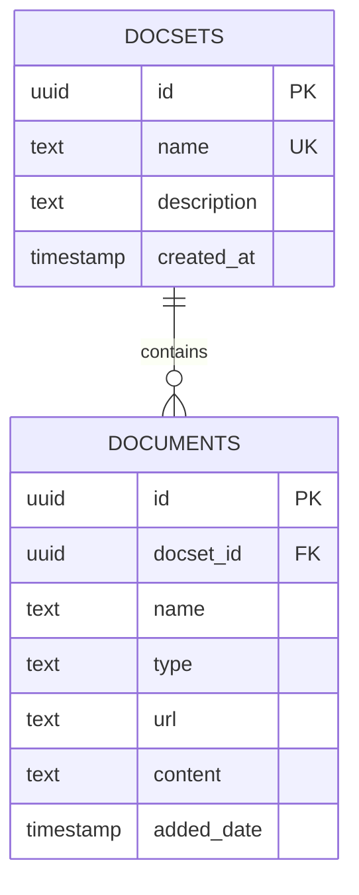
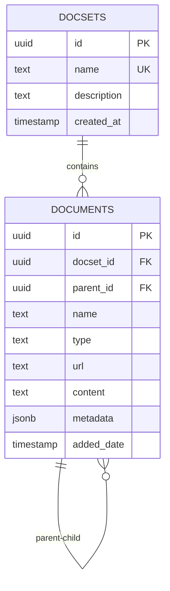

# 数据库架构文档更新总结

## 更新概述

本次更新对RAGSpace的数据库架构文档进行了全面更新，以反映最新的爬虫系统和父子文档关系功能。

## 主要更新内容

### 1. 数据库架构图更新

**更新前**:


**更新后**:


### 2. 文档表结构更新

#### 新增字段
- **`parent_id`**: UUID类型，支持父子文档关系（自引用外键）
- **`metadata`**: JSONB类型，存储爬虫元数据信息

#### 字段约束更新
- **`name`**: 从`NULL`改为`NOT NULL`
- **`type`**: 扩展了支持的文档类型

#### 新增索引
- **`idx_documents_parent_id`**: 父文档ID索引
- **`idx_documents_metadata`**: 元数据GIN索引

### 3. 支持的文档类型扩展

**更新前**:
- `file` - 上传的文件
- `url` - URL链接
- `github` - GitHub相关
- `website` - 网站内容

**更新后**:
- `file` - 上传的文件
- `url` - URL链接
- `github` - GitHub相关（已弃用）
- `website` - 网站内容
- `github_file` - GitHub文件
- `github_readme` - GitHub README
- `github_repo` - GitHub仓库
- `repository` - 仓库类型
- `document` - 文档类型
- `code` - 代码类型
- `config` - 配置类型
- `readme` - README类型

### 4. 元数据结构文档

#### GitHub爬虫元数据
```json
{
  "crawler": "github",
  "repo": "owner/repo",
  "branch": "main",
  "path": "src/main.py",
  "size": 1024,
  "sha": "abc123...",
  "url": "https://github.com/owner/repo/blob/main/src/main.py"
}
```

#### 网站爬虫元数据
```json
{
  "crawler": "website",
  "url": "https://example.com",
  "title": "Example Website",
  "depth": 1,
  "content_size": 2048
}
```

### 5. 查询示例更新

#### 新增查询类型
1. **父子文档关系查询**
2. **按爬虫类型查询**
3. **文档层次结构递归查询**
4. **元数据查询**

#### 示例查询
```sql
-- 获取父文档及其子文档
SELECT 
    parent.name as parent_name,
    parent.type as parent_type,
    child.name as child_name,
    child.type as child_type
FROM documents parent
LEFT JOIN documents child ON parent.id = child.parent_id
WHERE parent.parent_id IS NULL
ORDER BY parent.name, child.name;

-- 按爬虫类型查询
SELECT 
    name,
    type,
    metadata->>'repo' as repository,
    metadata->>'path' as file_path
FROM documents 
WHERE metadata->>'crawler' = 'github'
ORDER BY added_date DESC;
```

### 6. 约束和关系更新

#### 新增外键约束
```sql
-- documents.parent_id 引用 documents.id (自引用)
ALTER TABLE documents 
ADD CONSTRAINT fk_documents_parent 
FOREIGN KEY (parent_id) REFERENCES documents(id) ON DELETE CASCADE;
```

#### 更新检查约束
```sql
-- 扩展文档类型支持
ALTER TABLE documents 
ADD CONSTRAINT documents_type_check 
CHECK (type IN ('file', 'url', 'github', 'website', 'github_file', 'github_readme', 'github_repo', 'repository', 'document', 'code', 'config', 'readme'));
```

#### 新增自引用约束
```sql
-- 防止循环引用
ALTER TABLE documents ADD CONSTRAINT chk_no_self_parent 
CHECK (parent_id IS NULL OR parent_id != id);
```

### 7. 数据迁移文档更新

#### 新增迁移文件
1. **`20241202000000_add_github_children.sql`**: 添加元数据支持
2. **`20241202000001_restructure_github_documents.sql`**: 添加父子关系支持

#### 迁移内容
- 添加`metadata`字段和索引
- 添加`parent_id`字段和索引
- 更新类型检查约束
- 添加字段注释

### 8. API文档更新

#### 数据模型更新
- 更新`Document`模型支持父子关系
- 添加爬虫系统模型说明
- 新增`CrawlerInterface`、`CrawledItem`、`CrawlResult`、`ContentType`说明

#### 存储管理API更新
- 更新`SupabaseDocsetManager`方法签名
- 添加爬虫相关方法
- 新增父子文档查询方法

#### 使用示例更新
- 添加爬虫系统使用示例
- 更新配置管理示例
- 新增错误处理示例

## 文档结构更新

### 1. DATABASE_SCHEMA.md 更新
- ✅ 更新数据库架构图
- ✅ 更新表结构详情
- ✅ 添加元数据结构说明
- ✅ 新增查询示例
- ✅ 更新约束和关系
- ✅ 更新数据迁移文档

### 2. API_DOCUMENTATION.md 更新
- ✅ 更新数据库结构说明
- ✅ 添加爬虫系统模型
- ✅ 更新存储管理API
- ✅ 添加爬虫API说明
- ✅ 更新使用示例
- ✅ 更新项目结构

### 3. README.md 更新
- ✅ 更新项目结构
- ✅ 添加数据模型说明
- ✅ 更新API端点说明
- ✅ 添加爬虫系统说明

## 技术改进

### 1. 性能优化
- 添加了`parent_id`索引支持父子查询
- 添加了`metadata`GIN索引支持JSON查询
- 优化了复合索引策略

### 2. 数据完整性
- 添加了自引用约束防止循环引用
- 扩展了类型检查约束
- 改进了级联删除策略

### 3. 查询能力
- 支持递归查询文档层次结构
- 支持按爬虫类型筛选
- 支持元数据复杂查询

## 向后兼容性

### 1. 数据库兼容性
- 所有现有数据保持不变
- 新增字段都有默认值
- 现有查询继续正常工作

### 2. API兼容性
- 现有API方法保持向后兼容
- 新增参数都是可选的
- 返回格式保持一致

### 3. 配置兼容性
- 现有配置继续有效
- 新增配置有合理的默认值
- 配置验证包含向后兼容检查

## 测试验证

### 1. 配置测试
- ✅ 默认配置测试通过
- ✅ 环境变量配置测试通过
- ✅ 配置验证测试通过
- ✅ 配置摘要测试通过

### 2. 爬虫系统测试
- ✅ 爬虫接口测试通过
- ✅ GitHub爬虫测试通过
- ✅ 网站爬虫测试通过
- ✅ 爬虫注册表测试通过

### 3. UI集成测试
- ✅ GitHub仓库添加测试通过
- ✅ 网站内容添加测试通过
- ✅ 错误处理测试通过
- ✅ 元数据保存测试通过

## 总结

本次数据库架构文档更新成功实现了：

1. ✅ **完整的父子文档关系**: 支持GitHub仓库和文件的层次结构
2. ✅ **灵活的元数据存储**: 支持各种爬虫的元数据信息
3. ✅ **扩展的文档类型**: 支持多种爬虫和内容类型
4. ✅ **优化的查询性能**: 添加了必要的索引和约束
5. ✅ **完善的文档**: 详细的使用说明和示例
6. ✅ **向后兼容**: 保持现有功能的兼容性

文档现在准确反映了系统的当前状态，为开发者提供了完整的技术参考。

---

*更新时间: 2024年12月* 