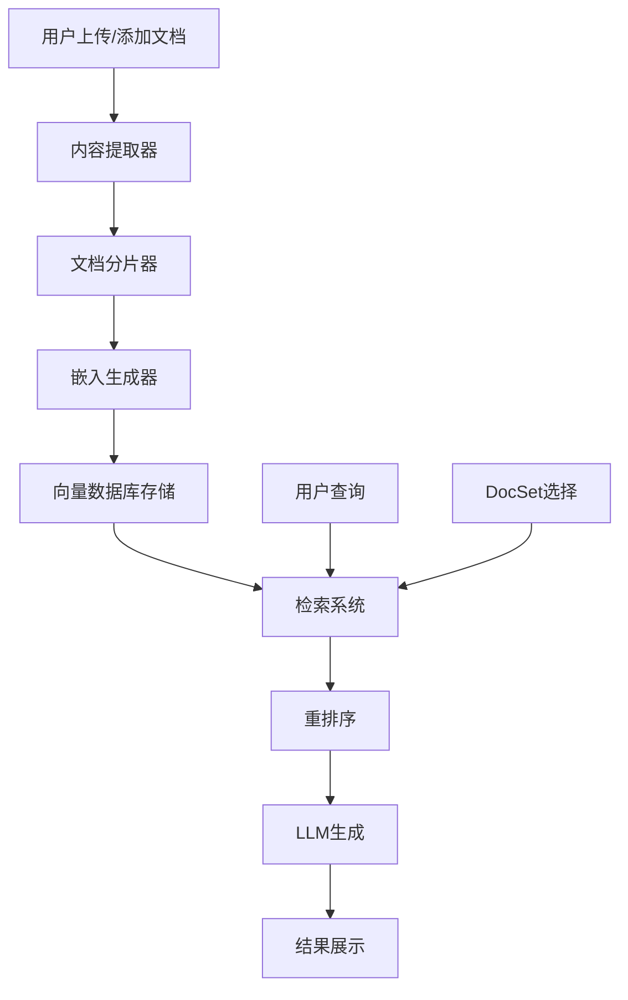

# RAGSpace RAG 系统设计文档

## 概述

本文档描述了RAGSpace项目中RAG（Retrieval-Augmented Generation）系统的完整设计方案，包括向量数据库配置、文档分片策略、嵌入流程、检索机制和用户界面集成。

## 系统架构

### 数据流图



## 1. 向量数据库配置

### 1.1 Supabase pgvector 设置

#### 启用向量扩展
```sql
-- 在 Supabase SQL Editor 中执行
CREATE EXTENSION IF NOT EXISTS vector;
```

#### 创建分片表
```sql
CREATE TABLE chunks (
  id uuid PRIMARY KEY DEFAULT gen_random_uuid(),
  docset_name TEXT NOT NULL,
  document_name TEXT NOT NULL,
  chunk_index INTEGER NOT NULL,
  content TEXT NOT NULL,
  embedding VECTOR(1536), -- OpenAI text-embedding-3-small 维度
  metadata JSONB DEFAULT '{}',
  created_at TIMESTAMP DEFAULT NOW()
);

-- 创建向量索引
CREATE INDEX ON chunks USING ivfflat (embedding vector_cosine_ops)
WITH (lists = 100);

-- 创建复合索引
CREATE INDEX idx_chunks_docset_document ON chunks(docset_name, document_name);
CREATE INDEX idx_chunks_metadata ON chunks USING GIN (metadata);
```

### 1.2 文档状态管理

#### 更新documents表
```sql
-- 添加嵌入状态字段
ALTER TABLE documents ADD COLUMN IF NOT EXISTS embedding_status TEXT 
DEFAULT 'pending' CHECK (embedding_status IN ('pending', 'processing', 'done', 'error'));

-- 添加嵌入时间字段
ALTER TABLE documents ADD COLUMN IF NOT EXISTS embedding_updated_at TIMESTAMP;
```

## 2. 嵌入流程设计

### 2.1 异步处理架构

```python
# 嵌入工作流程
用户添加文档 → 状态设为pending → 异步嵌入处理 → 状态更新为done
```

### 2.2 状态管理

| 状态 | 描述 | UI显示 |
|------|------|--------|
| `pending` | 等待嵌入处理 | 🟡 等待处理 |
| `processing` | 正在嵌入 | ⏳ 处理中... |
| `done` | 嵌入完成 | ✅ 已完成 |
| `error` | 嵌入失败 | ❌ 处理失败 |

## 3. 文档分片策略

### 3.1 文本类文档分片

```python
from langchain.text_splitter import RecursiveCharacterTextSplitter

def create_text_splitter():
    return RecursiveCharacterTextSplitter(
        chunk_size=500,
        chunk_overlap=100,
        separators=["\n\n", "\n", ".", " "],
        length_function=len
    )
```

### 3.2 代码类文档分片

```python
def create_code_splitter():
    return RecursiveCharacterTextSplitter(
        chunk_size=300,
        chunk_overlap=50,
        separators=["\nclass ", "\ndef ", "\n", " "],
        length_function=len
    )
```

### 3.3 分片策略选择

```python
def get_splitter_for_document(doc_type: str):
    """根据文档类型选择合适的分类器"""
    if doc_type in ['github_file', 'code']:
        return create_code_splitter()
    else:
        return create_text_splitter()
```

## 4. 元数据设计

### 4.1 分片元数据结构

```json
{
  "docset_name": "llama_index_tutorial",
  "document_name": "README.md",
  "source_type": "github",
  "url": "https://github.com/user/repo/blob/main/README.md",
  "start_line": 52,
  "end_line": 78,
  "chunk_index": 3,
  "language": "markdown",
  "file_path": "docs/README.md",
  "timestamp": "2024-12-01T13:00:00Z",
  "doc_type": "github_file",
  "repo": "owner/repo",
  "commit_id": "abc123..."
}
```

### 4.2 元数据字段说明

| 字段 | 类型 | 说明 |
|------|------|------|
| `docset_name` | string | 文档集合名称 |
| `document_name` | string | 文档名称 |
| `source_type` | string | 来源类型（github/website/file） |
| `url` | string | 原始URL |
| `start_line` | integer | 起始行号 |
| `end_line` | integer | 结束行号 |
| `chunk_index` | integer | 分片索引 |
| `language` | string | 编程语言 |
| `file_path` | string | 文件路径 |
| `timestamp` | string | 时间戳 |
| `doc_type` | string | 文档类型 |
| `repo` | string | 仓库信息（GitHub） |
| `commit_id` | string | 提交ID（GitHub） |

## 5. 嵌入服务

### 5.1 嵌入模型配置

```python
# 支持的嵌入模型
EMBEDDING_MODELS = {
    "openai": {
        "model": "text-embedding-3-small",
        "dimensions": 1536,
        "api_key_env": "OPENAI_API_KEY"
    },
    "qwen": {
        "model": "text-embedding-v1",
        "dimensions": 1536,
        "api_key_env": "DASHSCOPE_API_KEY"
    }
}
```

### 5.2 嵌入工作器

```python
class EmbeddingWorker:
    def __init__(self, model_name="openai"):
        self.model_name = model_name
        self.model_config = EMBEDDING_MODELS[model_name]
        self.client = self._init_client()
    
    def process_document(self, doc_id: str):
        """处理单个文档的嵌入"""
        # 1. 获取文档内容
        # 2. 分片处理
        # 3. 生成嵌入
        # 4. 存储到chunks表
        # 5. 更新文档状态
        pass
    
    def batch_process(self, docset_name: str = None):
        """批量处理待嵌入的文档"""
        pass
```

## 6. 检索策略

### 6.1 向量检索

```python
def retrieve_chunks(query: str, docsets: List[str] = None, top_k: int = 5):
    """向量检索主函数"""
    # 1. 生成查询嵌入
    query_embedding = generate_embedding(query)
    
    # 2. 构建查询
    query_builder = supabase.table("chunks").select("*")
    
    if docsets:
        query_builder = query_builder.in_("docset_name", docsets)
    
    # 3. 向量相似度搜索
    results = query_builder.order(
        f"embedding <-> '{query_embedding}'"
    ).limit(top_k).execute()
    
    return results.data
```

### 6.2 重排序策略

#### 方案一：纯向量检索
```python
def simple_retrieve(query: str, docsets: List[str] = None, top_k: int = 5):
    """简单向量检索"""
    return retrieve_chunks(query, docsets, top_k)
```

#### 方案二：GPT重排序（推荐）
```python
def gpt_rerank(query: str, chunks: List[Dict], top_k: int = 3):
    """使用GPT进行重排序"""
    prompt = f"""
    You are an expert technical assistant.
    
    Given the following user question and a list of code/document snippets retrieved from a knowledge base, rank the snippets by how relevant they are to answering the question.
    
    Question: {query}
    
    Snippets:
    {chr(10).join([f"{i+1}. {chunk['content'][:200]}..." for i, chunk in enumerate(chunks)])}
    
    Return the ranking as a JSON list of indices sorted from most to least relevant. Do not explain.
    Example: [2, 1, 3]
    """
    
    response = openai.chat.completions.create(
        model="gpt-3.5-turbo",
        messages=[{"role": "user", "content": prompt}],
        temperature=0
    )
    
    ranking = json.loads(response.choices[0].message.content)
    return [chunks[i] for i in ranking[:top_k]]
```

### 6.3 混合检索策略

```python
def hybrid_retrieve(query: str, docsets: List[str] = None, top_k: int = 5, use_rerank: bool = True):
    """混合检索策略"""
    # 1. 向量检索获取候选
    candidates = retrieve_chunks(query, docsets, top_k * 2)
    
    if not use_rerank:
        return candidates[:top_k]
    
    # 2. GPT重排序
    return gpt_rerank(query, candidates, top_k)
```

## 7. UI集成设计

### 7.1 聊天界面增强

```python
def create_chat_interface():
    """创建增强的聊天界面"""
    with gr.Blocks() as chat_interface:
        # DocSet选择器
        docset_selector = gr.CheckboxGroup(
            choices=get_docsets_list(),
            label="选择文档集合",
            value=["all"],
            interactive=True
        )
        
        # 聊天历史
        chatbot = gr.Chatbot(height=400)
        
        # 查询输入
        msg = gr.Textbox(label="输入问题")
        
        # 提交按钮
        submit = gr.Button("发送")
        
        # 清除按钮
        clear = gr.Button("清除")
        
        # 事件处理
        submit.click(
            process_query_with_rag,
            inputs=[msg, chatbot, docset_selector],
            outputs=[chatbot, msg]
        )
        
        clear.click(lambda: ([], ""), outputs=[chatbot, msg])
    
    return chat_interface
```

### 7.2 嵌入状态显示

```python
def create_embedding_status_ui():
    """创建嵌入状态显示界面"""
    with gr.Blocks() as status_ui:
        # 状态表格
        status_table = gr.Dataframe(
            headers=["文档名称", "文档集合", "状态", "更新时间"],
            datatype=["str", "str", "str", "str"],
            col_count=(4, "fixed"),
            interactive=False
        )
        
        # 刷新按钮
        refresh_btn = gr.Button("刷新状态")
        
        # 手动触发嵌入按钮
        trigger_embedding_btn = gr.Button("手动触发嵌入")
        
        # 事件处理
        refresh_btn.click(
            update_embedding_status,
            outputs=status_table
        )
        
        trigger_embedding_btn.click(
            trigger_embedding_process,
            outputs=status_table
        )
    
    return status_ui
```

### 7.3 检索结果展示

```python
def display_retrieval_results(results: List[Dict]):
    """展示检索结果"""
    markdown_content = ""
    
    for i, result in enumerate(results, 1):
        # 构建源链接
        source_link = f"[{result['document_name']} (行 {result['metadata']['start_line']}-{result['metadata']['end_line']})]({result['metadata']['url']}#L{result['metadata']['start_line']}-L{result['metadata']['end_line']})"
        
        # 构建内容展示
        content_preview = result['content'][:200] + "..." if len(result['content']) > 200 else result['content']
        
        markdown_content += f"""
        ### 结果 {i}
        
        **来源**: {source_link}
        
        **内容**:
        ```
        {content_preview}
        ```
        
        ---
        """
    
    return gr.Markdown(markdown_content)
```

## 8. 实现模块

### 8.1 核心模块结构

```
src/ragspace/
├── rag/
│   ├── __init__.py
│   ├── embedding_worker.py      # 嵌入工作器
│   ├── text_splitter.py        # 文本分片器
│   ├── retriever.py            # 检索器
│   ├── reranker.py             # 重排序器
│   └── metadata_builder.py     # 元数据构建器
├── config/
│   └── rag_config.py           # RAG配置
└── ui/
    └── components/
        └── rag_chat.py         # RAG聊天组件
```

### 8.2 配置管理

```python
# src/ragspace/config/rag_config.py
class RAGConfig:
    # 嵌入配置
    EMBEDDING_MODEL = "openai"
    EMBEDDING_DIMENSIONS = 1536
    
    # 分片配置
    TEXT_CHUNK_SIZE = 500
    TEXT_CHUNK_OVERLAP = 100
    CODE_CHUNK_SIZE = 300
    CODE_CHUNK_OVERLAP = 50
    
    # 检索配置
    DEFAULT_TOP_K = 5
    RERANK_TOP_K = 3
    USE_RERANK = True
    
    # 重排序配置
    RERANK_MODEL = "gpt-3.5-turbo"
    RERANK_TEMPERATURE = 0
```

## 9. 部署和监控

### 9.1 环境变量配置

```bash
# 嵌入模型配置
OPENAI_API_KEY=your-openai-api-key
DASHSCOPE_API_KEY=your-dashscope-api-key

# RAG配置
RAG_EMBEDDING_MODEL=openai
RAG_USE_RERANK=true
RAG_DEFAULT_TOP_K=5
```

### 9.2 监控指标

- 嵌入处理时间
- 检索响应时间
- 重排序准确率
- 用户满意度评分

## 10. 实施计划

### 阶段一：基础架构（1-2周）
- [ ] 创建chunks表
- [ ] 实现基础嵌入工作器
- [ ] 实现简单检索功能

### 阶段二：UI集成（1周）
- [ ] 集成聊天界面
- [ ] 添加DocSet选择器
- [ ] 实现状态显示

### 阶段三：优化（1周）
- [ ] 实现GPT重排序
- [ ] 优化检索策略
- [ ] 添加监控和日志

### 阶段四：测试和部署（1周）
- [ ] 全面测试
- [ ] 性能优化
- [ ] 生产部署

## 11. 技术栈

### 后端
- **向量数据库**: Supabase pgvector
- **嵌入模型**: OpenAI text-embedding-3-small
- **重排序**: GPT-3.5-turbo
- **分片**: LangChain RecursiveCharacterTextSplitter

### 前端
- **UI框架**: Gradio
- **状态管理**: Supabase实时订阅
- **交互**: 异步处理 + 状态更新

## 总结

本RAG系统设计提供了完整的文档检索和问答功能，具有以下特点：

1. ✅ **模块化设计**: 各组件独立，易于维护和扩展
2. ✅ **异步处理**: 不阻塞用户界面
3. ✅ **智能检索**: 支持向量检索 + GPT重排序
4. ✅ **用户友好**: 直观的状态显示和结果展示
5. ✅ **可扩展**: 支持多种嵌入模型和检索策略

通过这个设计，RAGSpace将能够提供高质量的文档检索和问答服务，为用户提供更好的知识管理体验。

---

*设计文档版本: 1.0*  
*更新时间: 2024年12月* 