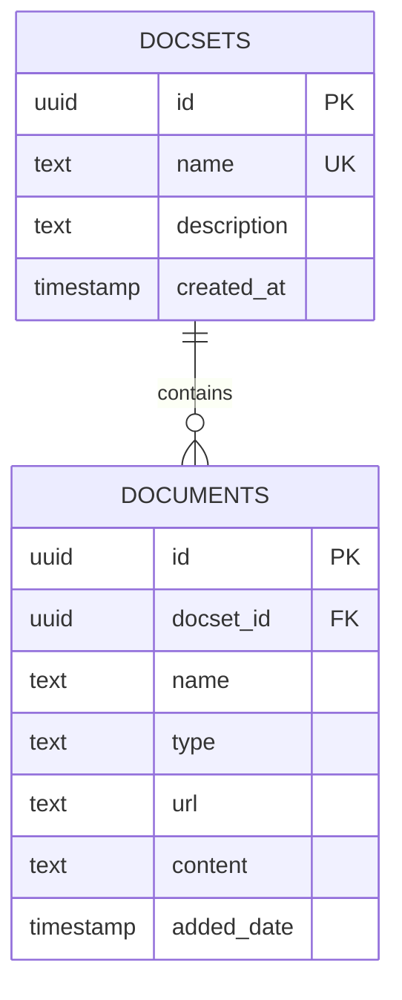

# RAGSpace API 快速参考

## 📋 文档概览

本文档提供了RAGSpace项目的完整API和数据结构参考。项目是一个基于AI的知识管理系统，支持文档集合管理、智能查询和MCP集成。

## 🚀 快速开始

### 1. 启动应用

```bash
# 安装依赖
pip install -r requirements.txt

# 设置环境变量
export SUPABASE_URL=your_supabase_url
export SUPABASE_KEY=your_supabase_key

# 启动应用
python app.py
```

### 2. 访问界面

- **Web界面**: <http://localhost:8000>
- **MCP端点**: <http://localhost:8000/gradio_api/mcp/>

## 📊 数据库结构

### 核心表

| 表名 | 用途 | 主要字段 |
|------|------|----------|
| `docsets` | 文档集合 | id, name, description, created_at |
| `documents` | 文档内容 | id, docset_id, name, type, content, url |

### 关系图



## 🔌 API端点

### Web界面API (Gradio)

| 端点 | 方法 | 功能 | 参数 |
|------|------|------|------|
| `/gradio_api/create_docset_ui` | POST | 创建文档集合 | name, description |
| `/gradio_api/upload_file_to_docset` | POST | 上传文件 | files, docset_name |
| `/gradio_api/add_url_to_docset` | POST | 添加网站 | url, docset_name, website_type |
| `/gradio_api/add_github_repo_to_docset` | POST | 添加GitHub仓库 | repo_url, docset_name |
| `/gradio_api/process_query` | POST | 处理查询 | query, history, docset_name |
| `/gradio_api/clear_chat` | POST | 清空聊天 | 无 |

### MCP工具API

| 工具名 | 端点 | 功能 | 参数 |
|--------|------|------|------|
| `list_docset` | `/gradio_api/list_docset` | 列出文档集合 | 无 |
| `ask` | `/gradio_api/ask` | 查询知识库 | query, docset |

## 💾 存储管理API

### SupabaseDocsetManager 核心方法

```python
from src.ragspace.storage import docset_manager

# 创建文档集合
result = docset_manager.create_docset("My Docs", "Description")

# 列出文档集合
result = docset_manager.list_docsets()

# 添加文档
result = docset_manager.add_document_to_docset(
    "My Docs", "Title", "Content", "file"
)

# 查询知识库
result = docset_manager.query_knowledge_base("query", "My Docs")
```

## 🛠️ 使用示例

### 1. Python客户端

```python
import requests

BASE_URL = "http://localhost:8000"

# 创建文档集合
def create_docset(name, description):
    response = requests.post(f"{BASE_URL}/gradio_api/create_docset_ui", 
                           data={"name": name, "description": description})
    return response.text

# 查询知识库
def query_knowledge(query, docset=None):
    data = {"query": query}
    if docset:
        data["docset"] = docset
    response = requests.post(f"{BASE_URL}/gradio_api/ask", data=data)
    return response.text
```

### 2. MCP工具使用

```bash
# 列出文档集合
mcp-inspector --config mcp_inspector_config.json --server ragspace --cli --method tools/list

# 查询知识库
mcp-inspector --config mcp_inspector_config.json --server ragspace --cli --method tools/call --tool-name ask --params '{"query": "What documents do I have?", "docset": null}'
```

### 3. cURL示例

```bash
# 创建文档集合
curl -X POST "http://localhost:8000/gradio_api/create_docset_ui" \
     -d "name=My Docs" \
     -d "description=My documentation collection"

# 查询知识库
curl -X POST "http://localhost:8000/gradio_api/ask" \
     -d "query=What is RAG?" \
     -d "docset=My Docs"
```

## 📁 项目结构

```
fun-withus-ragspace/
├── src/ragspace/
│   ├── models/           # 数据模型
│   │   ├── document.py   # 文档模型
│   │   └── docset.py     # 文档集合模型
│   ├── storage/          # 存储管理
│   │   ├── manager.py    # 内存存储管理器
│   │   └── supabase_manager.py  # Supabase存储管理器
│   ├── ui/               # 用户界面
│   │   ├── handlers.py   # 事件处理器
│   │   └── components/   # UI组件
│   └── mcp/              # MCP协议
│       └── tools.py      # MCP工具定义
├── supabase/             # 数据库配置
├── tests/                # 测试文件
├── app.py               # 主应用入口
└── requirements.txt      # 依赖列表
```

## 🔧 环境配置

### 必需环境变量

```bash
# Supabase配置
SUPABASE_URL=your_supabase_project_url
SUPABASE_KEY=your_supabase_anon_key

# 可选配置
GRADIO_SERVER_PORT=8000
GRADIO_SERVER_NAME=0.0.0.0
```

### 数据库初始化

```sql
-- 运行迁移脚本
-- supabase/migrations/20241201000000_create_ragspace_schema.sql

-- 应用种子数据
-- supabase/seed.sql
```

## 📊 数据模型

### Document 模型

```python
class Document:
    def __init__(self, title: str, content: str, doc_type: str = "file", metadata: Optional[Dict[str, Any]] = None):
        self.title = title
        self.content = content
        self.doc_type = doc_type  # "file", "website", "github"
        self.metadata = metadata or {}
        self.id = None
```

### DocSet 模型

```python
class DocSet:
    def __init__(self, name: str, description: str = ""):
        self.name = name
        self.description = description
        self.documents: List[Document] = []
        self.metadata = {
            "created_at": time.time(),
            "updated_at": time.time()
        }
```

## 🔍 错误处理

### 常见错误响应

| 错误类型 | 响应格式 | 解决方案 |
|----------|----------|----------|
| 文档集合不存在 | `DocSet 'name' not found` | 先创建文档集合 |
| 文档集合已存在 | `DocSet 'name' already exists` | 使用不同的名称 |
| Supabase连接错误 | `❌ Error: [详情]` | 检查环境变量和网络 |
| 参数验证错误 | `Please provide a query` | 检查输入参数 |

### 调试信息

应用输出格式：
- ✅ 成功操作
- ❌ 错误操作
- INFO: 信息日志

## 🚀 部署

### Docker部署

```dockerfile
FROM python:3.11-slim
WORKDIR /app
COPY requirements.txt .
RUN pip install -r requirements.txt
COPY . .
EXPOSE 8000
CMD ["python", "app.py"]
```

### Render部署

```yaml
services:
  - type: web
    name: ragspace
    env: python
    buildCommand: pip install -r requirements.txt
    startCommand: python app.py
    envVars:
      - key: SUPABASE_URL
        sync: false
      - key: SUPABASE_KEY
        sync: false
```

## 📈 性能优化

### 数据库索引

```sql
-- 性能优化索引
CREATE INDEX idx_documents_docset_id ON documents(docset_id);
CREATE INDEX idx_documents_type ON documents(type);
CREATE INDEX idx_documents_added_date ON documents(added_date);
```

### 查询优化

```sql
-- 优化复杂查询
SELECT d.name, d.type, ds.name as docset_name
FROM documents d
JOIN docsets ds ON d.docset_id = ds.id
WHERE ds.name = 'Python Documentation'
ORDER BY d.added_date DESC;
```

## 🔮 未来计划

### 即将实现的功能

1. **向量搜索**: 集成pgvector进行语义搜索
2. **用户认证**: 多用户支持和权限管理
3. **文件处理**: 支持更多文件格式（PDF、DOCX等）
4. **实时同步**: WebSocket实时更新
5. **API文档**: 自动生成OpenAPI文档

### 技术改进

1. **性能优化**: 查询缓存和索引优化
2. **安全增强**: 输入验证和SQL注入防护
3. **监控告警**: 应用性能监控
4. **容器化**: 完整的Docker Compose配置

## 📚 相关文档

- [API_DOCUMENTATION.md](API_DOCUMENTATION.md) - 详细API文档
- [API_ENDPOINTS.md](API_ENDPOINTS.md) - API端点详细说明
- [DATABASE_SCHEMA.md](DATABASE_SCHEMA.md) - 数据库架构文档
- [SUPABASE_INTEGRATION.md](SUPABASE_INTEGRATION.md) - Supabase集成指南

## 🤝 贡献

欢迎提交Issue和Pull Request来改进项目！

## 📄 许可证

本项目采用MIT许可证。

---

*最后更新: 2024年12月* 